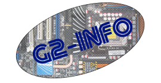

Pour le header: 

Lien Héroku: https://stevenaubert.herokuapp.com/

	<header class="header_menu">

			<ul class="list_menu">
					<li>Aubert Steven</li>

				<li><a href="#A_propos">A propos</a></li>

				<li><a href="#Compétence">Compétence</a></li>

				<li><a href="#Experience">Experience </a></li>

				<li><a href="#Formation">Formation</a></li>

				<li><a href="#formulaire">Contact</a></li>

			</ul>
		</header>

header
{
	font-family: sans-serif;
	margin: 0;
	padding:0;
	width: 100%;
	height: 10%;
	text-align: center;
line-height: 70px;
	background-image: url("../image/fond2.jpg");
	display:flex;

	text-align: center;

position: fixed;

}
.list_menu {

	list-style-type: none;
	margin: 0;
	padding: 0;
	overflow: hidden;
	background-color:
	position:fixed;
display: flex;
justify-content: space-around;
width: 100%;
}

J'ai fait une bande grise avecv tous mes liens à chaques parties tous centrés pour prendre toute la longueur. Les lien sont disposées horizontalements et bien espacées l'un de l'autre.

Pour le fond de couleur en body.
J'ai mis un fond gris foncée fesant resortir mon footer et mon header aissi que ma barre de réseaux transparent. 
J'ai voulu qu'il prennent toute la place et un avoir un seul fond unique pour ne pas mettre trops de couleurs.

body{
text-align: center;

	font-family: sans-serif;
	margin:0;
	padding:0;

background-image:url("../image/fond-noir.jpg");
background-repeat: no-repeat;
background-size: cover;

Pour la partie A propos.
 J'ai fait un paragraphe centré et mis deux photos correspondant à mes passions décrite dans le paragraphe.

	

						 
						<H1><u>A propos</u></H1>

						
Je m'appelle Steven Aubert, j'ai 19 ans et je suis en BTS Service informatique aux organisation au centre de formation Sainte Ursule à Caen. 
							J'ai comme passion l'escrime que j'effectue depuis 7 ans au club d'escrime à Falaise. Je suis animateur pendant les vacances scolaires et certains week-ends de l'année. 
							Je fait aussi à mes heures perdues de la modélisation 3D que j'imprime via mon imprimante 3D. J'aime bien l'informatique en générale et les jeux vidéo. 
							Je pratique divers sports comme le VTT ou le cross pendant les vacances. 
							J'aime bien le réseaux. Je suis très intéréssé par le dévelopement de jeux mais très peux par le dévellopement web. 
							 
							

							

						

.Apropos{
	margin-top: 20%;

	margin-bottom:20%;
height: 100vh;

}
#A_propos H1{
	padding-top: 5%;
}

Pour les compétences.
J'ai voulue mettre des barres de progréssions en cercle. Mais fesant beguer certaines fonctrions, je l'ai enlever pour mettre des barres de progressions simples.

	

							<H3><u>COMPETENCES</u><H3>

								<label for="file">html:</label>

								<progress id="file" max="100" value="50"> 30% </progress>

								<label for="file">css:</label>

								<progress id="file" max="100" value="50"> 30% </progress>

								<label for="file">php:</label>

								<progress id="file" max="100" value="5"> 10% </progress>

							

	label {
	    padding-right: 50px;
	    font-size: 2rem;

Pour les experiences professioneles.
Je l'est ai mises sous forme de listes avec le logos de l'entreprise en dessoue à chaque fois.

		

								<H3><u>	EXPERIENCE PROFESSIONNELLE</u></h3>

									

											<ul>

										<li>	<h4><u>Charal Flers – Stagiaire service informatique</u></h4></li>
										<li>	
Flers (14) – du 23 septembre au 18 octobre 2019
</li>

												<li>Réorganisation Baie de Brassage</li>
												<li> Réparation imprimante thermique</li>
												<li>Installation borne wifi</li>
											<li>	</li>

									<li>		<h4><u>	Pastoral des jeunes – animateur Stagiaire BAFA</u></h4></li>
									<li>		
Camps-à Lourdes – - Aout 2019 – 1 semaine puis 4 weekends à Caen (14)
</li>

											<li> Animateur d’un groupe de jeunes</li>
											<li> Création et gestion d’activité, de grands jeux et de veillés.</li>

									<li>		</li>

									<li>	<H4><u>	Aubertmenuiserie– CDD</u></h4></li>
										<li>	
Saint Pierre du Bu (14) – 17 juin au 31 juillet 2020 
</li>

												<li>Manutention de fenêtre</li>
												<li>Travaux chez le particulier et sur des constructions	d’immeubles/ lotissements</li>
												<li>	</li>

							<li><h4><u>G2-info– Stagiaire</u></H4></li>
											<li>	
Ronai (14) 2017-2019- 16 semaines répartie sur 4 sessions de 4 à 6 semaines
</li>

														<li>Recyclage d’ordinateur </li>
														<li>Installations de visioconférences </li>
														<li>Installations et configuration de téléphones IP </li>
														<li>Câblage en passant dans des sous-sols et des sous plafonds </li>
	<li></li>

</ul>

											

										

Pour la formations, j'ai fais trois blocks.
Une pour la formation et 1 pour chaques options.

	

			<h4>SISR</h4>
	Option SISR : Administration des systèmes et des réseaux : le titulaire participera à l'administration des systèmes et du réseau, il sera capable de modifier ou d'adapter les solutions d'infrastructure ainsi que la qualité de service des équipements du réseaux. 
	 Il acquiert ainsi les compétences pour concevoir une solution d'infrastructure réseau,  
	 l'installer, la tester et la déployer. L'élève apprend aussi à administrer et superviser ce réseau.

		

			

			<H4>SLAM</h4>

			
	Option SLAM : Conception et développement d'applications : l'élève participera à la conception, au développement, ainsi qu'au déploiement et à la maintenance des composants logiciels d'une solution applicative.  
				Il acquiert ainsi des compétences en conception et développement d'une solution applicative, 
				 en maintenance de celle-ci, mais aussi en bases de données et en gestion des données numériques.

			

	

		
Centre de formation Continue Sainte Ursule 30 Rue de la Miséricorde, 14000 Caen

	

.formation{
	margin-top: 20%;
	margin-bottom:30%;

}

.SISR{
	display: block;
}
.SLAM{
	display:block;
}

.logo
{
	height:500px;
	widht:470px;

Pour la barre réseaux.
Je n'ai pas mis de logo.
La barre esst transparente et défie bien lorsque l'on défile sur le site.
J'y est intégre mon bouton à l'interieur pour que l'utilisateur puisse bien voir mes réseaux.

		

											<a href="#" class="btn btn-default">Retour en haut ↑</a>

				<h3><u>réseaux</u></h3>
											<a href='https://twitter.com/home'
Twitter
<i class="fab fa-twitter"></i></a>
											<a href='https://www.instagram.com/steve9821419/  ' 
Instagram
<id class='instagram.png'></i></a>

									

.sm_side
{
    display: flex;
    flex-direction: column;
    position: fixed;
    margin-top: 15%;
		s-index:5;
}

.sm_side a
{
    display: block;
    font-size: 1.2em;
    color:#006076;
    background-color:tramsparent;
    padding: 8px;
    transition: 0.5s;
    text-decoration: none;

}

.sm_side a:hover
{
    background-color: #048b9a;
    color:#048b9a;
}

}

.sm_side a:hover
{

    content: 'tweeter';
    margin-left: 12px;
}

.sm_side a:hover:nth-child(5)::after
{

    margin-left: 12px;
}

Pour le formulaire, Beaucoup de dificulté mais le capcha fonctionne.

<?php
    echo "<h1>Contact</h1>";
?>

<form method='post' id="formulaire" action="#formulaire">
    <label for="firstname">prénom</label>
    <input type="text" name="firstname" id="firstname" required="true" placeholder="Entrez votre prénom" value="<?php if(isset($_POST['firstname'])){ echo $_POST['firstname']; /* code pour garder rempli les champs dans le cas d'un oubli de certains champs par exemple*/ } ?>">
    <label for="name">nom</label>
    <input type="text" name="name" id="name" required="true" placeholder="Entrez votre nom" value="<?php if(isset($_POST['name'])){ echo $_POST['name']; } ?>">
    <label for="email">email</label>
    <input type="email" name="email" id="email" required="true" placeholder="Entrez votre adresse email" value="<?php if(isset($_POST['email'])){ echo $_POST['email']; } ?>">
    <label for="message">message</label>
    <textarea rows="5" name="message" id="message" required="true" placeholder="Entrez votre message" value="<?php if(isset($_POST['message'])){ echo $_POST['message']; } ?>"></textarea>
    

    <input type="submit" value="Envoyer" id="envoyer" name="submitpost">
</form>

<?php
   ('recaptcha/autoload.php');

    if(isset($_POST['submitpost'])){
        if(isset($_POST['g-recaptcha-response'])){
            if(!empty($_POST['g-recaptcha-response'])) {
                $recaptcha = new \ReCaptcha\ReCaptcha('6LemleAZAAAAAP1qf1bBgqkCB3wcWJ2uIFN1fmPq
');
                $resp = $recaptcha->verify($_POST['g-recaptcha-response']); //vérification de la réponse renvoyé par le formulaire de captcha
                if ($resp->isSuccess()) { //si la réponse est un succès alors on exécute le code d'envoi du formulaire
                // Verified!
                    if(isset($_POST['email'])) //si le champ email existe
                    {
                        if(!empty($_POST['firstname']) and !empty($_POST['name']) and !empty($_POST['email']) and !empty($_POST['message'])) //si les champs sont complétés
                        {   // ----Formats d'encodage----
                            $header ="MIMI-Version 1.0\r\n";
                            $header .= 'From: "stevenaubert.fr/profil" <steven.aubert@sts-sio-caen.info>' . "\n";
                            $header .='Content-Type:text/html; charset="utf-8"'. "\n";
                            $header .='Content-Transfer-Encoding: 8bit';

                            // ----Message----
                            $message = '
                            <html>
                                <body>
                                    <ul>Prénom : '.$_POST['firstname']. '</ul>
                                    <ul>NOM : '.$_POST['name']. '</ul>
                                    <ul>adresse mail : '.$_POST['email']. '</ul>
                                    <ul>Message : '.nl2br($_POST['message']). '</ul>
                                </body>
                            </html>';
                            mail("steven.aubert@sts-sio-caen.info ", "Mail contact profil pro", $message, $header); //envoi du mail avec la fonction mail(adresse cible, objet, message et en-tête)
                            $msg="
<i class='fas fa-check'></i> Votre message à bien été envoyé !
";
                        }else{
                            $msg="
Veuillez compléter tout les champs !
";
                        }
                    }
                }
            } else {
                $msg_captcha="
<i class='fas fa-times'></i> merci de valider le captcha
";
            }
        }
    }

    if(isset($msg)) {
        echo $msg;
    } //on écrit le message qu'il soit la confirmation d'envoi ou un message d'erreur

    if(isset($msg_captcha)) {
        echo $msg_captcha;
    }
?>

form {
  /* Uniquement centrer le formulaire sur la page */
  margin: 0 auto;
  width: 400px;
  /* Encadré pour voir les limites du formulaire */
  padding: 1em;
  border: 1px solid #CCC;
  border-radius: 1em;
}

form div + div {
  margin-top: 1em;
}

label {
  /* Pour être sûrs que toutes les étiquettes ont même taille et sont correctement alignées */
  display: inline-block;
  width: 90px;
  text-align: left;
}

input, textarea {
  /* Pour s'assurer que tous les champs texte ont la même police.
     Par défaut, les textarea ont une police monospace */
  font: 1em sans-serif;

  /* Pour que tous les champs texte aient la même dimension */
  width: 300px;
  box-sizing: border-box;

  /* Pour harmoniser le look & feel des bordures des champs texte */
  border: 1px solid #999;
}

input:focus, textarea:focus {
  /* Pour souligner légèrement les éléments actifs */
  border-color: #000;
}

textarea {
  /* Pour aligner les champs texte multi‑ligne avec leur étiquette */
  vertical-align:top;

  /* Pour donner assez de place pour écrire du texte */
  height: 5em;
}

.button {
  /* Pour placer le bouton à la même position que les champs texte */
  padding-left: 90px; /* même taille que les étiquettes */
}

button {
  /* Cette marge supplémentaire représente grosso modo le même espace que celui
     entre les étiquettes et les champs texte */
  margin-left: .5em;
}

